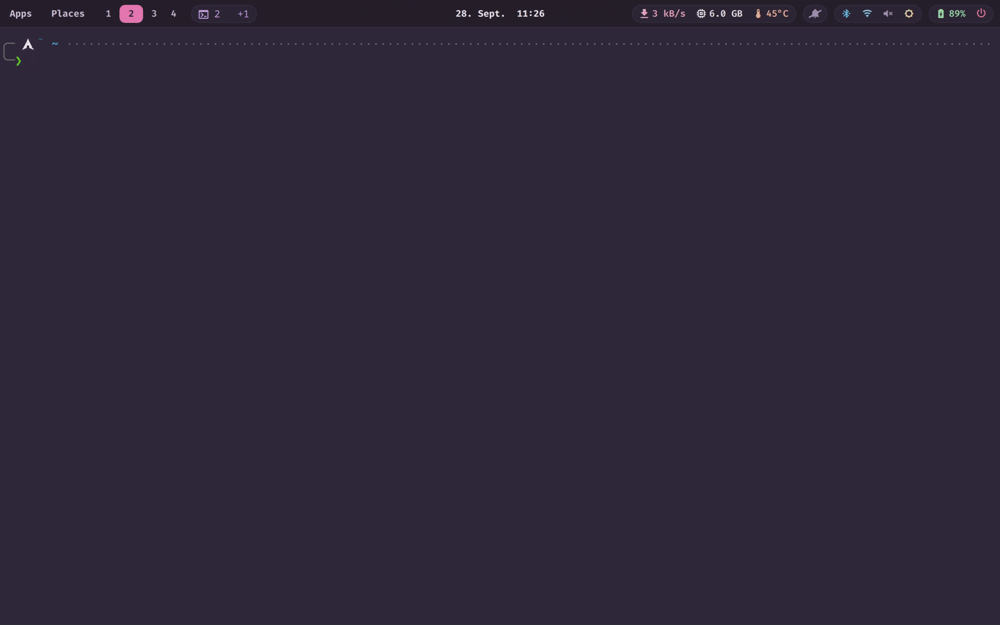
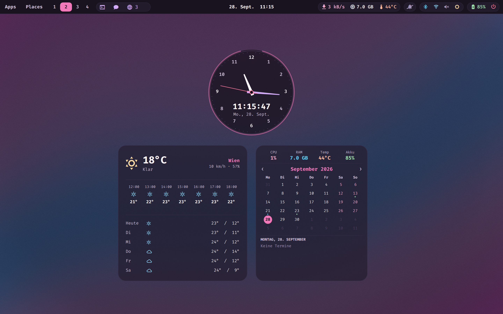
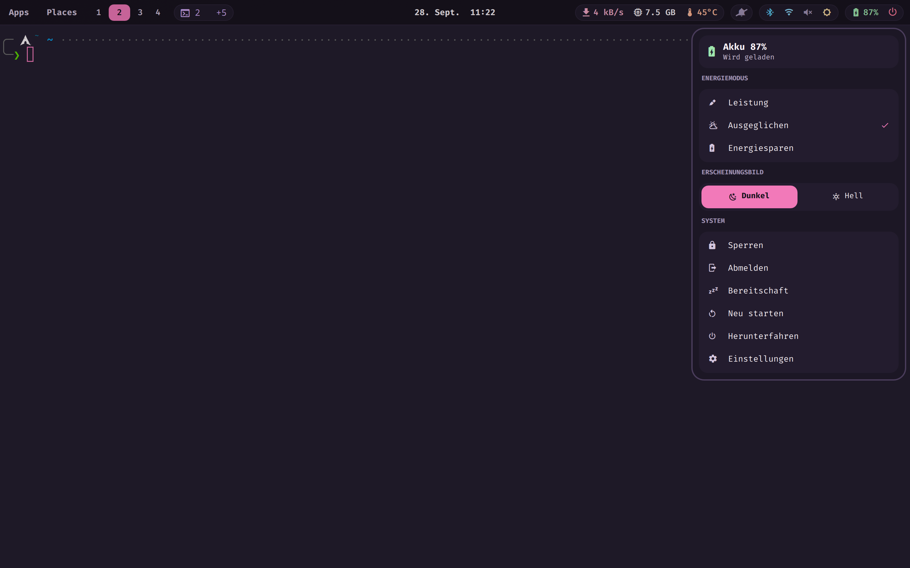
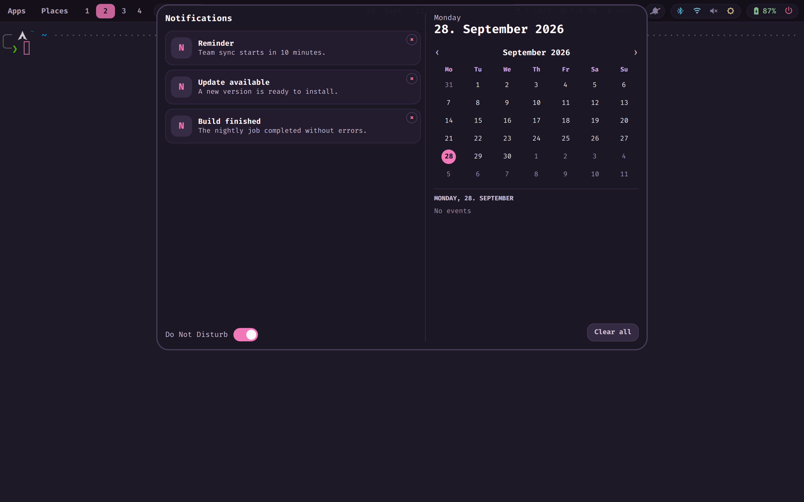
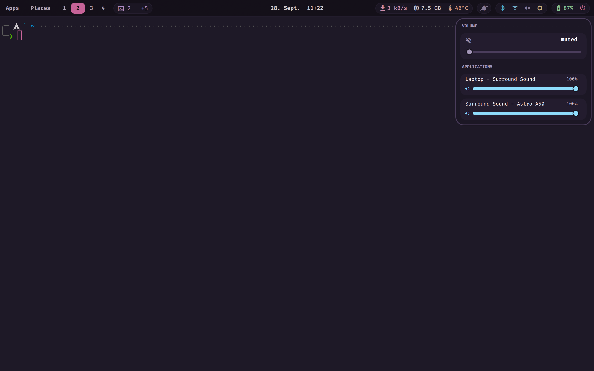
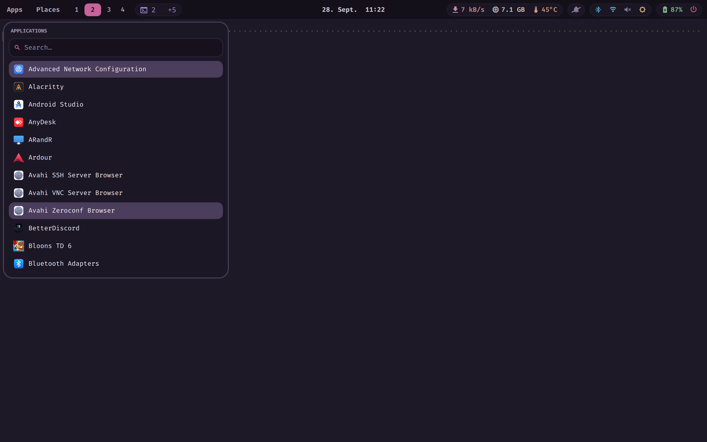
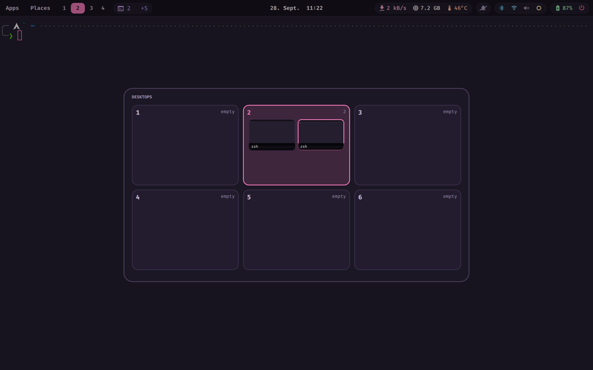
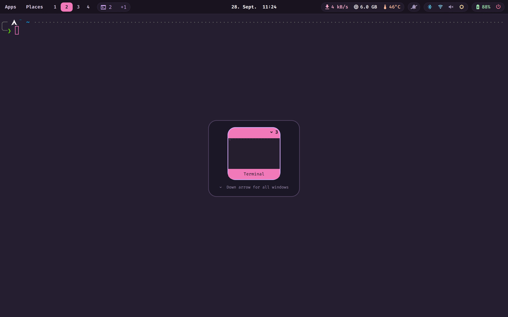
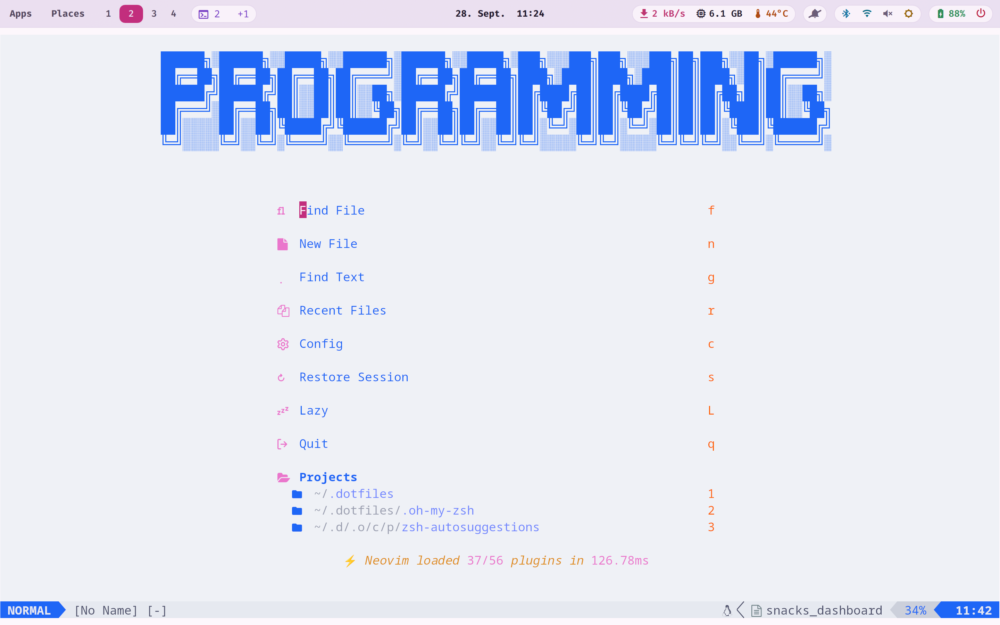

<div align="center">

# hypr-desktop

A Hyprland desktop built to replace GNOME without losing what GNOME did well.

[](./LICENSE)

</div>



<div align="center"><sub>Toggling the theme — the bar, panels and kitty's own colors cross-fade live. Also available as <a href="docs/demo/theme-crossfade.mp4">full-resolution video</a> (60 fps). Neovim re-themes on its next start, not mid-clip, so it isn't shown switching here.</sub></div>

The bar, the notification centre, the panels, the wallpaper, the Alt+Tab
switcher and the desktop widgets are all one [Quickshell](https://quickshell.org)
process. System state reaches them over a local MQTT broker rather than through
polling. Neovim is configured for TypeScript, Java, Python and Go with LSP,
debugging and formatting.

Everything here runs on one machine — an Arch laptop with a 2880x1800 display at
scale 2. It is published because the reasoning is written down, not because it
is a framework: read the comments, take the parts that apply, ignore the rest.

## Features

### Bar



- One Quickshell process renders the bar, panels, wallpaper and widgets together — not waybar, which reloads its whole layer surface on every colour-scheme change (see [Why it is built this way](#why-it-is-built-this-way)).
- Every colour on the bar comes from one `Theme` singleton, so it never lags behind the rest of the shell when the theme switches.
- Status figures (audio, battery, network, temperature) arrive over MQTT, published by `bin/hypr-eventd` — the bar never polls for them itself.

### Quick settings



- Panel visibility is bound to the card's opacity, not the open flag (`visible: menus.open || card.opacity > 0.01`), so the closing animation actually renders instead of the layer surface vanishing mid-transition.
- Shared transition: opacity and scale from 0.94, anchored under the button that opened it, behind a 0.18 scrim, over 190 ms.
- Toggles read and write the same MQTT topics `hypr-eventd` publishes (`hypr/audio`, `hypr/network`, `hypr/bluetooth`, `hypr/power`), so the panel and the bar never disagree about current state.

### Notifications



- `NotificationCenter.qml` shares the same opacity-bound visibility and 190 ms transition as every other panel, fixed for the same reason (see `ARCHITECTURE.md`).
- `SUPER+N` pops the last notification without opening the full panel.
- Retained MQTT topics mean a notification's underlying state (e.g. battery, network) is already current the moment the panel opens, not fetched on open.

### Controls



- Audio state comes from `pactl subscribe`, measured end to end at about 24 ms from a real volume change to the shell repainting.
- Media keys drive volume, brightness and playback directly; the panel is for anything a key doesn't cover (output device, precise level).
- Brightness reporting uses `poll()` on the backlight's `actual_brightness`, the one topic here without a native subscribe API — measured at about 5 ms regardless.

### App menu



- Opened with `CTRL+ALT+S`, `SUPER+A` or `SUPER+R` — three bindings to the same menu, matching the GNOME defaults this desktop replaces so muscle memory carries over.
- Backed by `bin/hypr-apps-menu` / `bin/hypr-launch`, not a separate launcher process — one more surface the same Quickshell instance owns.

### Overview



- Toggled from `hyprland.lua` via `qs ipc call overview toggle` — an IPC call into the running Quickshell process rather than a second program.
- Window thumbnails and workspace layout are read live from Hyprland's own IPC, not cached or re-derived from window state Quickshell tracks separately.

### Alt+Tab



- Lives entirely in `AltTab.qml`: while the overlay holds exclusive keyboard focus, Hyprland's own binds stop firing, so all overlay navigation (arrow keys, Escape, stepping) has to be handled here instead of in the Hyprland config.
- `ALT+Tab` / `ALT+SHIFT+Tab` step forward/backward; `Down arrow` expands an application's windows; `SUPER+Tab` cycles without opening the overlay at all.

### Light theme



- Every colour is bound to the one `Theme` singleton, and a `Behavior` on each property animates the change — the whole shell cross-fades together instead of individual widgets jumping at different times, as shown in the demo at the top of this README.
- The cross-fade runs at 170 ms; it was 260 ms until measurement showed programs that switch outright (kitty, GTK apps, browsers) finishing two frames before the animated surfaces caught up.

## Why it is built this way

**The bar is not waybar.** waybar listens for the portal's `color-scheme`
itself and reloads completely when it changes — tearing down its layer surface
and rebuilding it, visibly disappearing for about 100 ms. Measured frame by
frame. It cannot be turned off. Here every colour is bound to one `Theme`
singleton that animates them, so the whole shell cross-fades together.

**Nothing polls.** A daemon (`bin/hypr-eventd`) reads `/proc` and `/sys`
directly and subscribes to the real event sources — `pactl subscribe`,
`ip monitor`, `gsettings monitor`, and `poll()` on the backlight's
`actual_brightness`. It publishes to MQTT; the shell subscribes. Measured end
to end:

```
brightness   ~5 ms     sysfs_notify
volume/mute  ~24 ms    pactl subscribe
theme        ~82 ms    gsettings monitor
sensors      <=750 ms  daemon tick (no event source exists)
```

What it replaced ran a shell script every 2 s that forked **107 `clone()` and
75 `execve()` calls per run** — measured with strace.

**Login lands on a warm desktop.** Widget caches live in `~/.cache`, not
`$XDG_RUNTIME_DIR`, which systemd wipes when the last session ends. MQTT topics
are retained, so the first painted frame carries real values instead of zeros.
The calendar cache is rebuilt at login and again at shutdown.

**One colour across every boot stage.** The console palette, Hyprland's empty
desktop and the wallpaper's fallback are all `#3b3554` — the measured mean of
the wallpaper image. There is no black flash between the greeter and the shell,
only the structure of the image fading in.

See [docs/ARCHITECTURE.md](docs/ARCHITECTURE.md) for the full shape of it — the
message broker's own reasoning, why sensor readings are medians not maxima, and
the panel-visibility bug behind every panel's transition above.

## Tech stack

| Piece | What it is |
|---|---|
| Hyprland 0.55+ | Window manager, Lua config format |
| [Quickshell](https://quickshell.org) | The whole shell — bar, panels, widgets, wallpaper, notifications |
| mosquitto | The local MQTT broker `hypr-eventd` publishes to |
| Python | `hypr-eventd` and the other `bin/hypr-*` daemons/helpers |
| Neovim + lazy.nvim | Editor, LSP (`mason-lspconfig`), `nvim-dap`, `nvim-jdtls` for Java |
| Nerd Font | Icons in the bar and panels |
| Arch Linux | The only distribution this is built and tested on |

Full list and setup in [docs/INSTALL.md](docs/INSTALL.md).

## Getting started

```sh
git clone https://github.com/Wolfi-OwO/hypr-desktop.git
cd hypr-desktop
./install.sh
```

See [docs/INSTALL.md](docs/INSTALL.md) for what that does and what it
deliberately leaves for you (your monitor config, the boot-time console-palette
fix).

## Project structure

```text
hypr-desktop/
├─ bin/                     # hypr-* helper scripts and daemons the shell calls (Python/shell)
│  └─ hypr-eventd           # the event daemon: /proc, /sys and subscribe-based sources -> MQTT
├─ config/
│  ├─ hypr/                 # Hyprland (Lua config), lock screen, wallpaper
│  ├─ quickshell/           # The whole shell: Bar, panels, widgets, Theme singleton
│  ├─ nvim/                 # Neovim: lazy.nvim, LSP, nvim-dap, conform, treesitter
│  ├─ mosquitto/            # The event bus broker, tuned for a small footprint
│  ├─ betterdiscord/        # Custom CSS (font override), plugins/themes stay untracked
│  └─ fontconfig/           # Font substitution rules
├─ systemd/
│  ├─ user/                 # Broker, event daemon, calendar cache units
│  ├─ system-sleep/         # Resume hook (timesync restart, lock-notify handling)
│  ├─ logind.conf.d/        # Inhibit-delay override (not copied by install.sh, root-owned)
│  └─ timesyncd.conf.d/     # Fast NTP retry after a long suspend (same, root-owned)
├─ docs/                    # Architecture, install, keybindings, troubleshooting
│  ├─ screenshots/          # README feature screenshots
│  └─ demo/                 # README demo clip
├─ install.sh               # Entry point; see docs/INSTALL.md for what it skips on purpose
└─ README.md
```

## Documentation

| Document | What it covers |
|---|---|
| [docs/ARCHITECTURE.md](docs/ARCHITECTURE.md) | How the pieces fit, and why |
| [docs/INSTALL.md](docs/INSTALL.md) | Dependencies, setup, what to change first |
| [docs/KEYBINDINGS.md](docs/KEYBINDINGS.md) | Every binding |
| [docs/TROUBLESHOOTING.md](docs/TROUBLESHOOTING.md) | Failures hit here, and the fixes |
| [CONTRIBUTING.md](CONTRIBUTING.md) | Conventions, if you send a patch |

## License

MIT. See [LICENSE](LICENSE).
